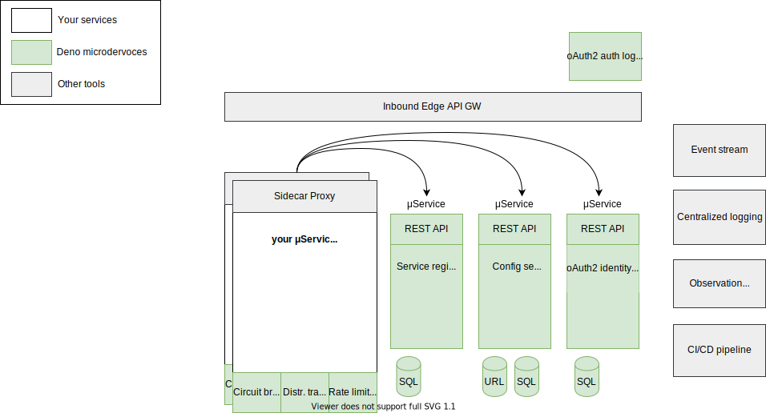

# deno-microservices

Simple and useful tools for deno microservices:

- Deno + Typescript
- Based on standard microservices patterns [https://microservices.io/patterns/microservices.html](https://microservices.io/patterns/microservices.html)
- Minimum third party dependencies
- No side effects
- Pure μ services - no global service manager

Standalone μ services:

- deno-config-server
  - REST API with open api spec 3.0
  - One runnable file
  - No forced client library - just HTTP API
  - Different config stores: URI based, MySQL, ...
  - Minimum configuration - one JSON
  - ETag support
  - In-memory cache
  - Minimum third party libs (only oak and mysql - if used)
  - Support for GIT and NoSQL in progress
- deno-service-discovery
  - REST API with open api spec 3.0
  - service registry - only self registry - no additional manager needed (like zookeeeper or eureka)
  - service discovery - server-side (with client load balancer) & server-side
  - service lifecycle management by health check
  - information resource
- deno-oauth2-identity
  - REST API with open api spec 3.0
  - oAuth2 and open ID Connect identity provider
  - suitable also for machine2machine authentication
  - web login pages (μ frontend)
  - multi-factor authentication
  - fast secure-token-service

Libs:

- deno-circuit-breaker
  - in progress
- deno-rate-limiting
  - in progress
- deno-distributed-tracing
  - in progress
