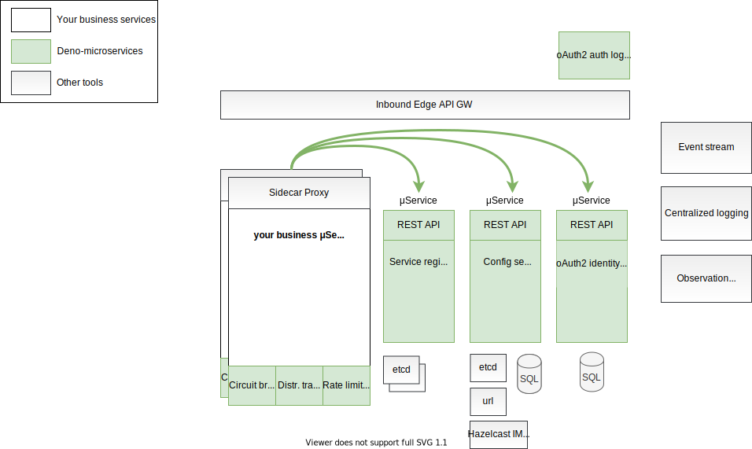

# deno-microservices

Simple and useful tools for deno microservices:

- Deno + Typescript
- Based on standard microservices and SOA patterns [https://microservices.io/patterns/microservices.html](https://microservices.io/patterns/microservices.html)
- Minimum third party dependencies
- No side effects
- Pure μ services - no global service manager

Standalone μ services:

- deno-config-server
  - REST API with Open api spec 3.0
  - One runnable file
  - No forced client library - just HTTP API
  - Different config stores: URI based, MySQL, ...
  - Minimum configuration - one JSON
  - ETag support
  - In-memory cache
  - Minimum third party libs (only oak and mysql - if used)
  - Support for GIT, MongoDB, Hazelcast IMDG, etcd, Zookeeper in progress
  - Fault tolerance data replication based on external storage capabilities
- deno-service-discovery
  - REST API with Open api spec 3.0
  - Service registry - self registry
  - Running aside of business service
  - Fault tolerant data replication based on external storage - zookeeper or etcd (consider availability) or distributed storage - MongoDB or Hazelcast IMDG (consider consistency)
  - service discovery - client-side (client load balancer) as well as server-side (external load balancer)
  - service lifecycle management
  - resource for info about services status
- deno-oauth2-identity
  - REST API with open api spec 3.0
  - oAuth2 and Open ID Connect identity provider
  - suitable also for machine2machine authentication
  - web login pages (μ frontend)
  - multi-factor authentication
  - fast secure-token-service

Libs:

- deno-circuit-breaker
  - in progress
- deno-rate-limiting
  - in progress
- deno-distributed-tracing
  - in progress

# Documentation

Please see [wiki](./wiki) for detailed documentation.

